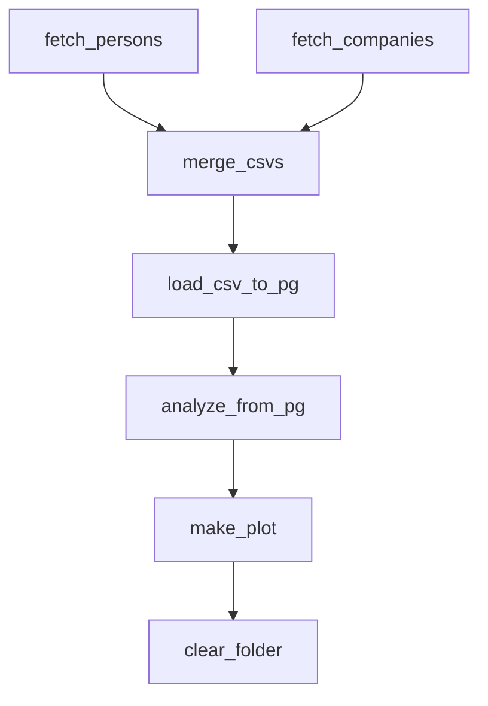
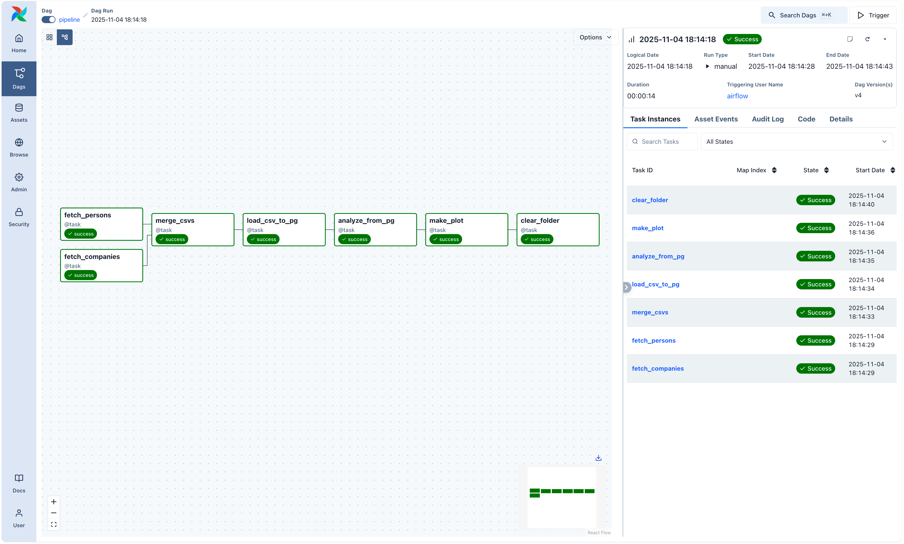
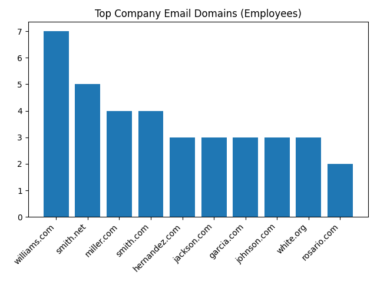

[](https://github.com/nyonyoko/IDS706_Data_Engineering_Systems/actions/workflows/main.yml)

# IDS 706 – Week 10: Airflow Data Pipeline

This assignment demonstrates an **Apache Airflow pipeline** that ingests, transforms, and loads synthetic data into a PostgreSQL database, followed by an analysis and visualization step.  
The workflow demonstrates the logic of modern data pipelines — from **data ingestion** to **transformation**, **database loading**, and **automated analysis** — all orchestrated by Airflow.

---

## Pipeline Structure

### 1. **Environment Setup**
The environment uses a full Airflow stack deployed via `docker-compose` with:
- **PostgreSQL** as the metadata and result backend.
- **Redis** as the Celery broker.
- **CeleryExecutor** for parallel task execution.
- Custom-built Airflow image from `.devcontainer/.Dockerfile` with required dependencies.

Key dependencies:

```
Faker==37.12.0
matplotlib
apache-airflow-providers-postgres
```

---

### 2. **DAG: `pipeline`**

| Step | Task                | Description                                                                                            |
| ---- | ------------------- | ------------------------------------------------------------------------------------------------------ |
| 1  | `fetch_persons()`   | Generates a synthetic dataset of 100 people using the **Faker** library and saves it as `persons.csv`. |
| 2  | `fetch_companies()` | Generates a second dataset of 100 companies and saves it as `companies.csv`.                           |
| 3  | `merge_csvs()`      | Merges both datasets by index, combining person and company info into `merged_data.csv`.               |
| 4  | `load_csv_to_pg()`  | Loads the merged CSV into **PostgreSQL** under schema `week8_demo.employees`.                          |
| 5  | `analyze_from_pg()` | Runs a SQL query to extract the **top 10 company email domains** by frequency.                         |
| 6  | `make_plot()`       | Visualizes the result using **Matplotlib** and saves it to `/opt/airflow/data/plots/top_domains.png`.  |
| 7  | `clear_folder()`    | Cleans up all temporary files but **keeps the plots directory**.                                       |

---

### 3. **DAG Workflow**

The DAG is defined in [`dags/demo.py`](dags/demo.py) and runs once (`@once`) on trigger.



---

## Results

### Successful Pipeline Execution

**Pipeline Run Screenshot**

> 

---

### Visualization Output

After execution, the visualization is saved at:

```
data/plots/top_domains.png
```

**Top Company Email Domains**

> 

---

## Repository Structure

```
week10/
├── .devcontainer/
│   ├── .Dockerfile
│   ├── db.env
│   ├── docker-compose.yml
├── config/
│   └── airflow.cfg
├── dags/
│   └── demo.py
├── data/
│   └── plots/
│       └── top_domains.png
├── logs/
├── plugins/
├── Makefile
├── requirements.txt
└── assets/
    └── screenshot.png
```

---

## How to Run

1. **Start Airflow**

   ```bash
   docker compose up -d
   ```

2. **Access the Web UI** at [http://localhost:8080](http://localhost:8080)

   * Username: `airflow`
   * Password: `airflow`

3. **Trigger the DAG** named `pipeline`.

4. After completion:

   * Check database table: `week8_demo.employees`
   * Find plot in: `data/plots/top_domains.png`
