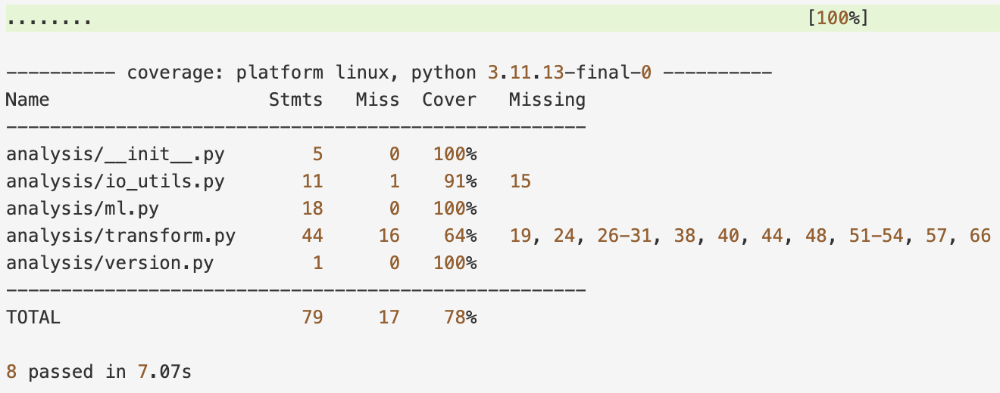

[](https://github.com/nyonyoko/IDS706_Data_Engineering_Systems/actions/workflows/main.yml)

# IDS 706 – Week 3: Reproducible & Testable Data Analysis

This week I turned the exploratory notebooks from **Week 2** into a **reproducible, testable** Python mini-package with **unit + system tests**, and provided **both** a Dev Container and a Docker image so the project runs the same everywhere (local, Codespaces, CI).

## What’s new this week

* **Refactor to package**: notebook logic extracted into `analysis/`:

  * I/O (`load_csv` for pandas/polars)
  * Transformations (filtering, grouping, safe conversion)
  * ML utilities (preprocessing, logistic regression, accuracy)
* **Tests**: focused unit tests + one end-to-end “system” test (data → transform → model → evaluate)
* **Reproducible env**:

  * **Dev Container** (VS Code/Codespaces)
  * **Dockerfile** (build once, run anywhere)
* **Automation**: Makefile targets for install/format/lint/test; logs saved under `.logs/`.

> This folder integrates with the repo’s “changed weeks” CI workflow, so pushes to `week3/` trigger CI for `week3` only.

---

## Folder layout

```
week3/
  ├─ analysis/                # testable Python code
  │   ├─ __init__.py
  │   ├─ io_utils.py
  │   ├─ transform.py
  │   ├─ ml.py
  │   └─ version.py
  ├─ tests/                   # pytest unit + system tests
  │   ├─ test_io_utils.py
  │   ├─ test_transform.py
  │   ├─ test_ml.py
  │   └─ test_system_end_to_end.py
  ├─ requirements.txt         # pinned runtime + dev deps
  ├─ Makefile                 # install / format / lint / test
  ├─ Dockerfile               # builds an image that runs pytest by default
  └─ README.md                # this file
```

---

## Setup & usage

### A) Dev Container (recommended)

Open the repo in VS Code → **Reopen in Container**.
The root devcontainer runs the “changed weeks” flow, so `week3` tests execute automatically on start.

Manually:

```bash
cd week3
make install      # upgrade pip + install deps
make test         # run pytest w/ coverage (logs saved to .logs/)
```

### B) Local (no container)

```bash
python3 -m venv .venv
source .venv/bin/activate      # Windows: .venv\Scripts\activate
cd week3
make install
make test
```

### C) Docker

```bash
# from repo root
docker build -t week3-image -f week3/Dockerfile .
docker run --rm week3-image
```

---

## Makefile targets (inside `week3/`)

```bash
make install       # install deps from requirements.txt
make format        # format with black
make format-check  # check formatting (no changes)
make lint          # flake8
make test          # pytest + coverage (saves .logs/pytest_<timestamp>.log)
make clean         # remove caches + logs
make               # same as `make all`: install + format + lint + test
```

---

## CI behavior

* The repo uses a matrix workflow that **auto-detects changed `week*/` folders** and runs them independently.
* Each week folder runs its own Makefile steps (`install`, `format-check`, `lint`, `test`).
* Tests log to `week3/.logs/…` locally; CI shows results in the Actions tab.

---

## From Week 2 → Week 3 (goals & results)

**Week 2 goal**: perform exploratory analysis in notebooks (pandas & polars), including simple filtering/grouping and a lightweight ML demo.

**Week 3 deliverable**: the same ideas are now:

* **Modularized** into testable functions (`analysis/`).
* **Covered** by unit tests (I/O, filtering, grouping, preprocessing, model) and a **system test** (tiny CSV → pipeline → accuracy).
* **Reproducible** across environments (Dev Container + Docker).
* **Automated** with lint/format/test in Make + CI.

---

## Screenshot of passed test run


---

## Notes & extensions

* Line length is aligned with Black (88). If you use a root `.flake8`, it applies repo-wide.
* To enforce a minimum coverage, add in `Makefile`:

  ```makefile
  pytest -q --cov=analysis --cov-report=term-missing --cov-fail-under=85
  ```
* If you want to test notebooks directly later, add `pytest-nbmake` and run `pytest --nbmake path/to.ipynb`.
