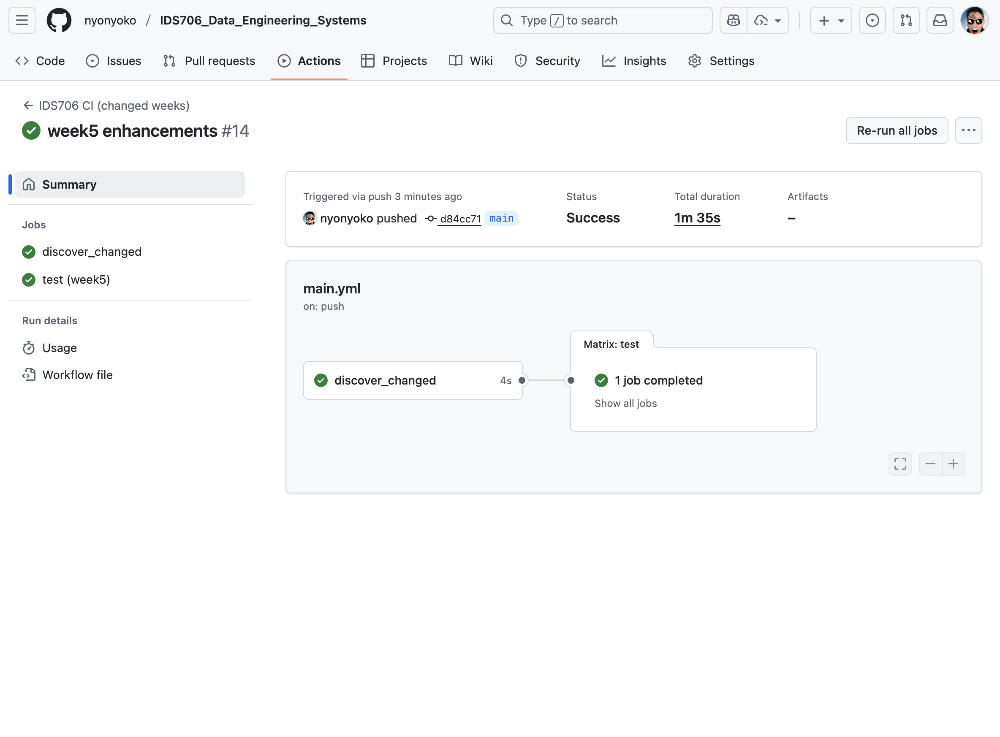
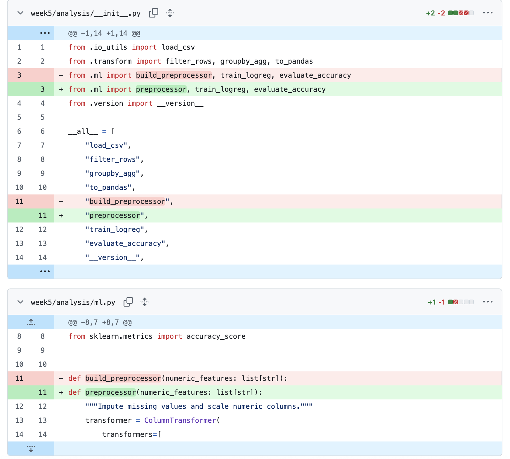
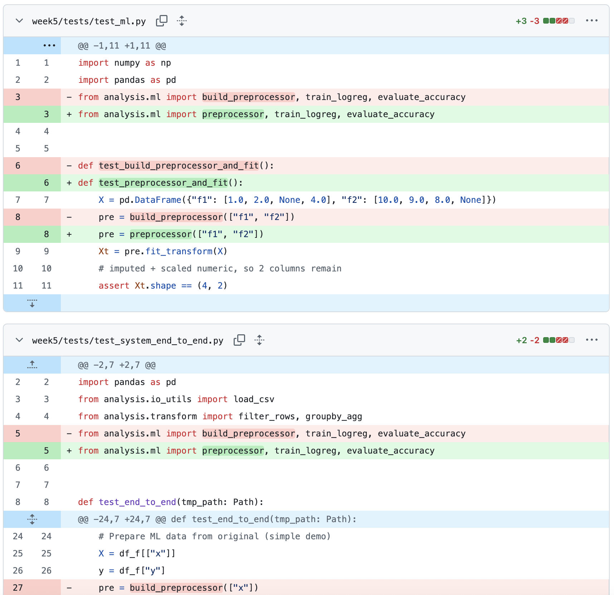

[](https://github.com/nyonyoko/IDS706_Data_Engineering_Systems/actions/workflows/main.yml)

# IDS 706 – Week 5: Enhancing Mini-assignments with Tools and Content

> This wraps up the two-week data analysis project by documenting automation, refactors, and polish.
>
> Most requirements (CI, code quality, tests, reproducibility) were already satisfied in **Week 3 setup** derived from **Week 2 notebooks** ; this final pass confirms and refines them.

## What changed in this final pass

### 1) Refactors (Rename)

- **`analysis/ml.py`**
  - `build_preprocessor` ➜ **`preprocessor`**
- **`tests/test_ml.py`**
  - `test_build_preprocessor_and_fit` ➜ **`test_preprocessor_and_fit`**

These renames were performed via editor-assisted **Rename Symbol** (F2) to safely update all references.

> Note on “Extract method/variable”: I evaluated potential extracts (e.g., around intermediate frames like `df_f`). In this code path those values are used by following lines and are already clear/atomic, so extraction wouldn’t reduce duplication or improve readability. I left the logic as is to avoid unnecessary indirection.

### 2) CI & Status Badge

- CI workflow (GitHub Actions) is already set up to run on **changed `week*/` folders** .
- Status badge is already added to README (see top of this file).
- CI runs **install → format-check → lint → tests** using each week’s Makefile.

### 3) Code Quality & Tooling (already done previously)

- **Black** formatting (`make format`, `make format-check`).
- **Flake8** linting (`make lint`), aligned to Black’s line length.
- **Pytest + coverage** with logs stored under `.logs/`.
- **Reproducible env** : Dev Container **and** Dockerfile for Week 3.
- **Matrix-ready repo layout** : Each week self-contained with its own `Makefile` and `requirements.txt`.

---

## Why these changes

- **Consistent naming** improves readability and maintenance (`preprocessor` succinctly expresses “returns a preprocessing pipeline”).
- **No-op extraction** was avoided to keep code straightforward and keep tests focused on real behavior rather than indirection.
- **Badge + CI** make build health visible at a glance (and verifiable in Actions).

---

## How to run (unchanged)

### Dev Container (recommended)

Open in VS Code/Cursor → **Reopen in Container** . The root devcontainer triggers the “changed weeks” flow and runs tests for `week3/`.

Manual:

```bash
cd week3
make install
make test
```

### Local (no container)

```bash
python3 -m venv .venv
source .venv/bin/activate            # Windows: .venv\Scripts\activate
cd week3
make install
make test
```

### Docker

```bash
# from repo root
docker build -t week3-image -f week3/Dockerfile .
docker run --rm week3-image
```

---

## Screenshots to include

1. **CI success run**

   _GitHub → Actions → select successful run → screenshot summary_

   

2. **Commit diff (before/after rename)**

   _GitHub → Commits → select commit → “Browse files” → pick file → “View changes”_

   

   

---

## File map (unchanged)

```
week3/
  analysis/            # testable code (io_utils, transform, ml, version)
  tests/               # unit + system tests
  requirements.txt     # deps
  Makefile             # install/format/lint/test
  Dockerfile           # containerized test run
  README.md            # this file
```
