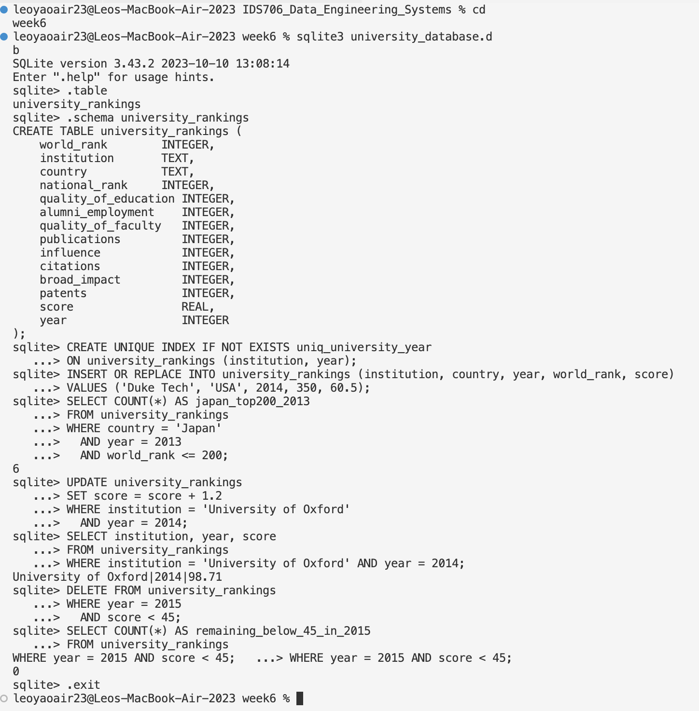

[](https://github.com/nyonyoko/IDS706_Data_Engineering_Systems/actions/workflows/main.yml)

# IDS 706 – Week 6: Introduction to Databases

This assignment demonstrates how to perform key SQL operations (insertion, selection, updating, and deletion) on a **SQLite** database containing global university rankings.
All commands were executed using the SQLite command-line interface after connecting to the database.

---

## Database Schema

The database table used:

```sql
CREATE TABLE university_rankings (
    world_rank             INTEGER,
    institution            TEXT,
    country                TEXT,
    national_rank          INTEGER,
    quality_of_education   INTEGER,
    alumni_employment      INTEGER,
    quality_of_faculty     INTEGER,
    publications           INTEGER,
    influence              INTEGER,
    citations              INTEGER,
    broad_impact           INTEGER,
    patents                INTEGER,
    score                  REAL,
    year                   INTEGER
);
```

A unique index was added to prevent duplicate entries for the same institution and year:

```sql
CREATE UNIQUE INDEX IF NOT EXISTS uniq_university_year
ON university_rankings (institution, year);
```

---

## 1. Insert a New University (2014)

```sql
INSERT OR REPLACE INTO university_rankings (institution, country, year, world_rank, score)
VALUES ('Duke Tech', 'USA', 2014, 350, 60.5);
```

**Explanation:**

Adds a new entry for Duke Tech in 2014.

Using `INSERT OR REPLACE` ensures that if a record for the same `(institution, year)` already exists, it will be replaced rather than duplicated.

---

## 2. Count Japanese Universities in the Top 200 (2013)

```sql
SELECT COUNT(*) AS japan_top200_2013
FROM university_rankings
WHERE country = 'Japan'
  AND year = 2013
  AND world_rank <= 200;
```

**Explanation:**

Counts how many universities from **Japan** ranked within the **top 200 globally in 2013** .

**Result:**

```
6
```

So, there were **6 Japanese universities** in the global top 200 in 2013.

---

## 3. Update University of Oxford’s Score (2014)

```sql
UPDATE university_rankings
SET score = score + 1.2
WHERE institution = 'University of Oxford'
  AND year = 2014;
```

**Explanation:**

Increases the 2014 score for **University of Oxford** by +1.2 points to correct a miscalculation.

**Verification:**

```sql
SELECT institution, year, score
FROM university_rankings
WHERE institution = 'University of Oxford' AND year = 2014;
```

**Result:**

```
University of Oxford | 2014 | 98.71
```

---

## 4. Delete Low-Scoring Universities (2015)

```sql
DELETE FROM university_rankings
WHERE year = 2015
  AND score < 45;
```

**Explanation:**

Removes universities with a **score below 45** in **2015** , per the committee’s new inclusion criteria.

**Verification:**

```sql
SELECT COUNT(*) AS remaining_below_45_in_2015
FROM university_rankings
WHERE year = 2015 AND score < 45;
```

**Result:**

```
0
```

All low-scoring entries from 2015 were successfully removed.

---

## Summary of Results

| Task | Query Type | Key Finding                               |
| ---- | ---------- | ----------------------------------------- |
| 1    | INSERT     | Added Duke Tech (USA, 2014)               |
| 2    | SELECT     | 6 Japanese universities in top 200 (2013) |
| 3    | UPDATE     | Oxford 2014 score → 98.71                 |
| 4    | DELETE     | Removed all 2015 scores < 45              |

---

**Tools Used:**

- SQLite 3 (command-line interface)
- `queries.sql` script containing all commands above

---

## Screenshots to include

**Terminal Results**


