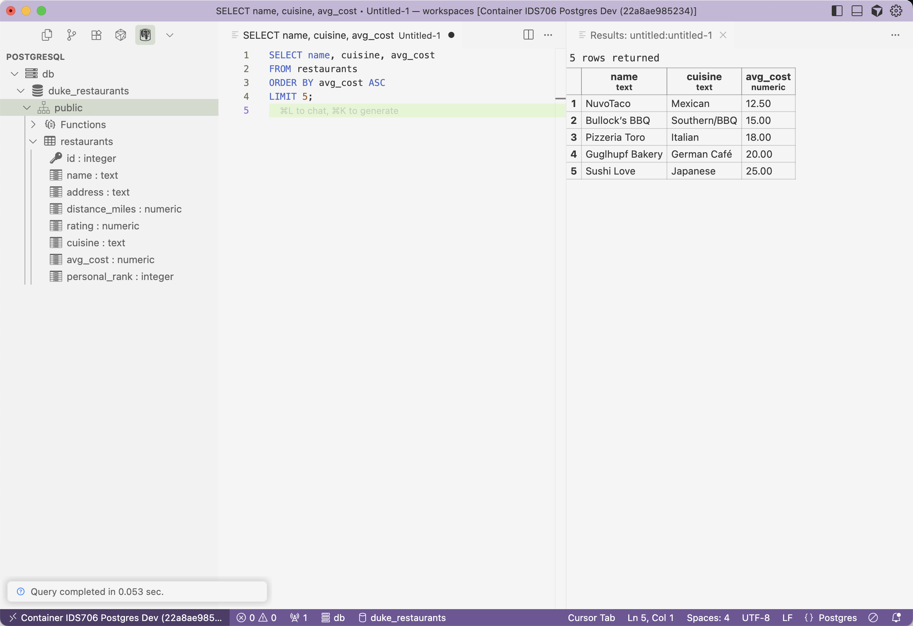
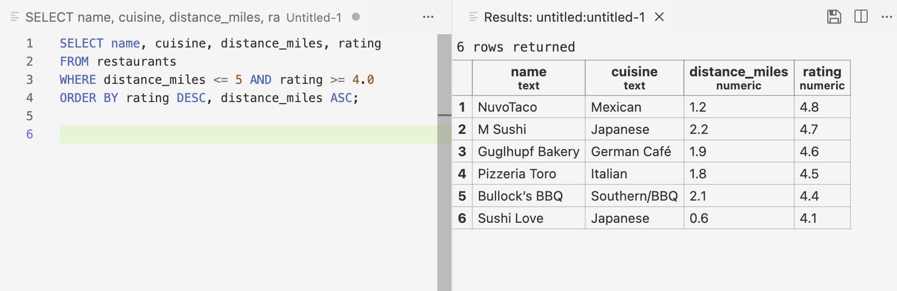
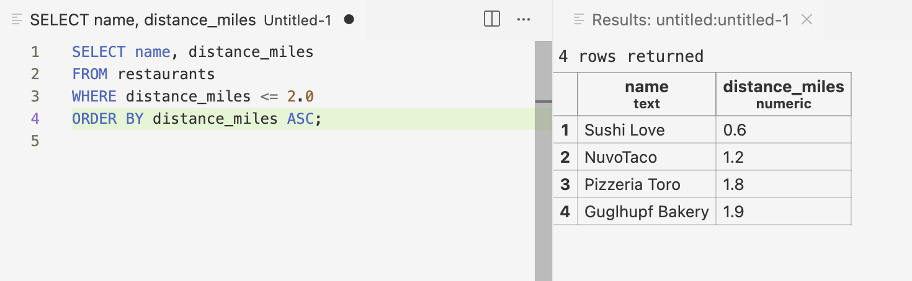
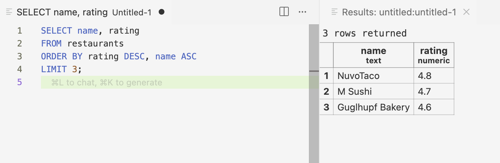
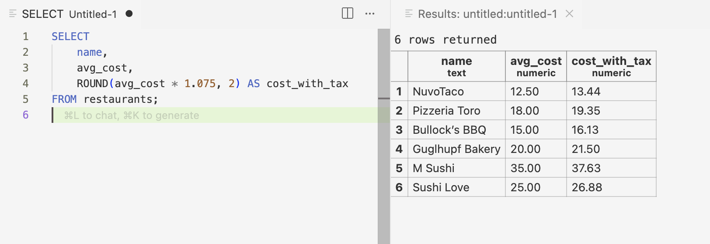
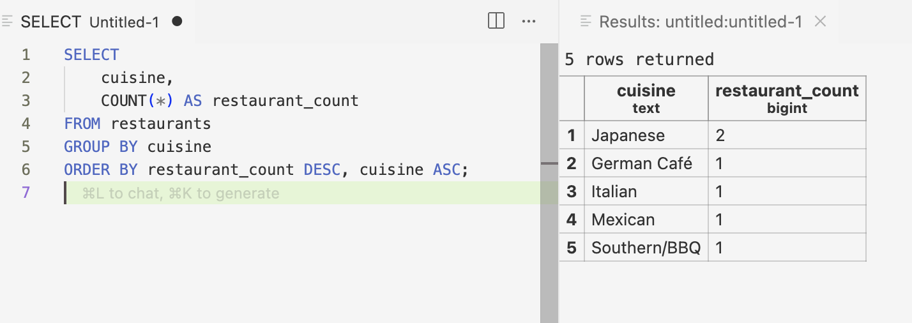
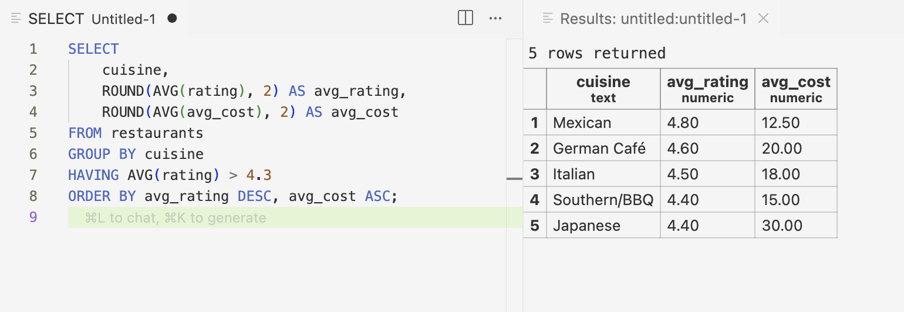

[](https://github.com/nyonyoko/IDS706_Data_Engineering_Systems/actions/workflows/main.yml)

# Week 6 – In-Class PostgreSQL Exercise

This mini in-class project demonstrates how to spin up a **PostgreSQL database inside a VS Code Dev Container with Docker**, auto-seed it with sample restaurant data, and explore the database using both the **psql CLI** and the **VS Code PostgreSQL Explorer** extension.  

The exercise covers:
- Setting up a Postgres container with an initialization script (`init.sql`)
- Connecting to the database from VS Code
- Writing and running SQL queries against the `restaurants` table
- Capturing results as screenshots for reference

---

## Setup Summary
- The `.devcontainer/` folder in this directory contains a `devcontainer.json` and `docker-compose.yml` which launch:
  - A **`db` service** running PostgreSQL 16
  - A **`dev` service** running Python for potential scripting
- `init.sql` seeds the `restaurants` table with several Durham restaurants and attributes like `distance_miles`, `rating`, `cuisine`, and `avg_cost`.
- Once the container is running, the database appears in the VS Code PostgreSQL Explorer sidebar and can be queried interactively.

---

## SQL Queries and Results

Each of the following queries was executed against the `restaurants` table. A screenshot of the output is attached beneath each query.

### 1. The 5 cheapest restaurants  
```sql
SELECT name, cuisine, avg_cost
FROM restaurants
ORDER BY avg_cost ASC
LIMIT 5;
````



---

### 2. Highly rated restaurants within 5 miles

```sql
SELECT name, cuisine, distance_miles, rating
FROM restaurants
WHERE distance_miles <= 5 AND rating >= 4.0
ORDER BY rating DESC, distance_miles ASC;
```




---

### a. Restaurants within 2 miles

```sql
SELECT name, distance_miles
FROM restaurants
WHERE distance_miles <= 2.0
ORDER BY distance_miles ASC;
```




---

### b. Top 3 restaurants by rating

```sql
SELECT name, rating
FROM restaurants
ORDER BY rating DESC, name ASC
LIMIT 3;
```



---

### c. Average cost with 7.5% tax

```sql
SELECT 
    name,
    avg_cost,
    ROUND(avg_cost * 1.075, 2) AS cost_with_tax
FROM restaurants;
```



---

### d. Number of restaurants per cuisine

```sql
SELECT cuisine, COUNT(*) AS restaurant_count
FROM restaurants
GROUP BY cuisine
ORDER BY restaurant_count DESC, cuisine ASC;
```



---

### More Exploratory: Cuisine averages (rating + cost)

```sql
SELECT 
    cuisine,
    ROUND(AVG(rating), 2) AS avg_rating,
    ROUND(AVG(avg_cost), 2) AS avg_cost
FROM restaurants
GROUP BY cuisine
HAVING AVG(rating) > 4.3
ORDER BY avg_rating DESC, avg_cost ASC;
```


